native systems, calm tools, sharp edges.

 

## selected work

### [Harbor](https://github.com/lia0s1/Harbor)

Native macOS workspace for SSH, SFTP, port forwarding, and infrastructure control.

<pre>$ echo $CURRENT_FOCUS
turning heavy operations into simple, native workflows.</pre>
